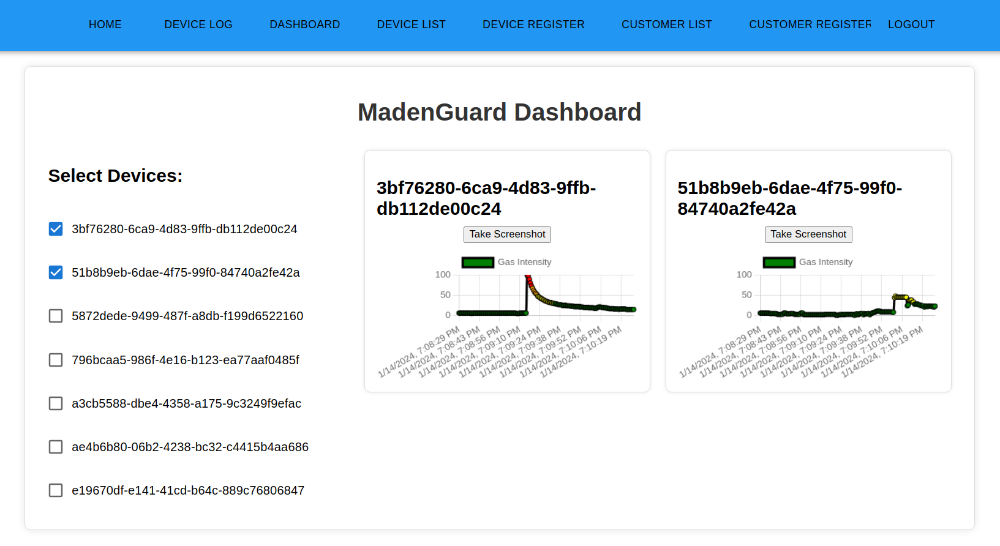

# 

# MadenGuard : Gas Leak Detection System for Mines
A master-slave network utilizing ESP-32 and MQ-9 sensor for real-time gas leak detection in mines. Node.js server and web interface for data processing and visualization. Enhancing mine safety through prompt response to gas leaks revolutionizing hazard management in mining operations.

## System Architecture

## Dashboard

## Device Log Page

## Device Details Page

