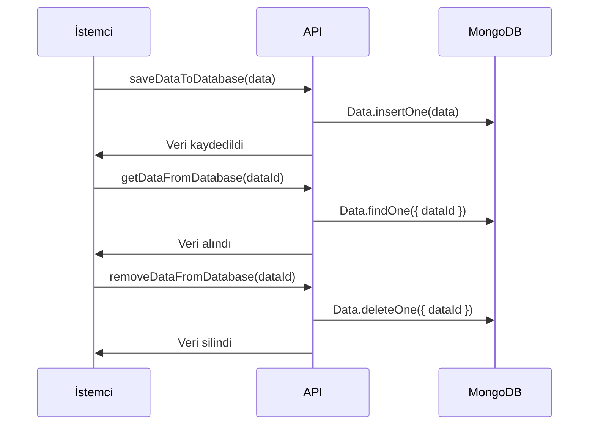

```mermaid
sequenceDiagram
    participant İstemci
    participant API
    participant MongoDB

    İstemci->>API: saveDataToDatabase(data)
    API->>MongoDB: Data.insertOne(data)
    API->>İstemci: Veri kaydedildi

    İstemci->>API: getDataFromDatabase(dataId)
    API->>MongoDB: Data.findOne({ dataId })
    API->>İstemci: Veri alındı

    İstemci->>API: removeDataFromDatabase(dataId)
    API->>MongoDB: Data.deleteOne({ dataId })
    API->>İstemci: Veri silindi
```