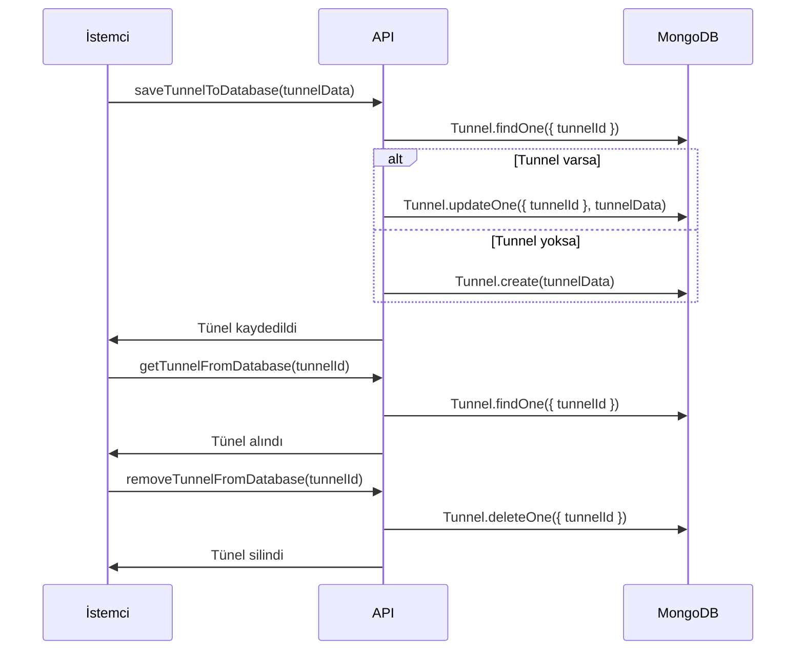

```mermaid
sequenceDiagram
    participant İstemci
    participant API
    participant MongoDB

    İstemci->>API: saveTunnelToDatabase(tunnelData)
    API->>MongoDB: Tunnel.findOne({ tunnelId })
    alt Tunnel varsa
        API->>MongoDB: Tunnel.updateOne({ tunnelId }, tunnelData)
    else Tunnel yoksa
        API->>MongoDB: Tunnel.create(tunnelData)
    end
    API->>İstemci: Tünel kaydedildi

    İstemci->>API: getTunnelFromDatabase(tunnelId)
    API->>MongoDB: Tunnel.findOne({ tunnelId })
    API->>İstemci: Tünel alındı

    İstemci->>API: removeTunnelFromDatabase(tunnelId)
    API->>MongoDB: Tunnel.deleteOne({ tunnelId })
    API->>İstemci: Tünel silindi
```
