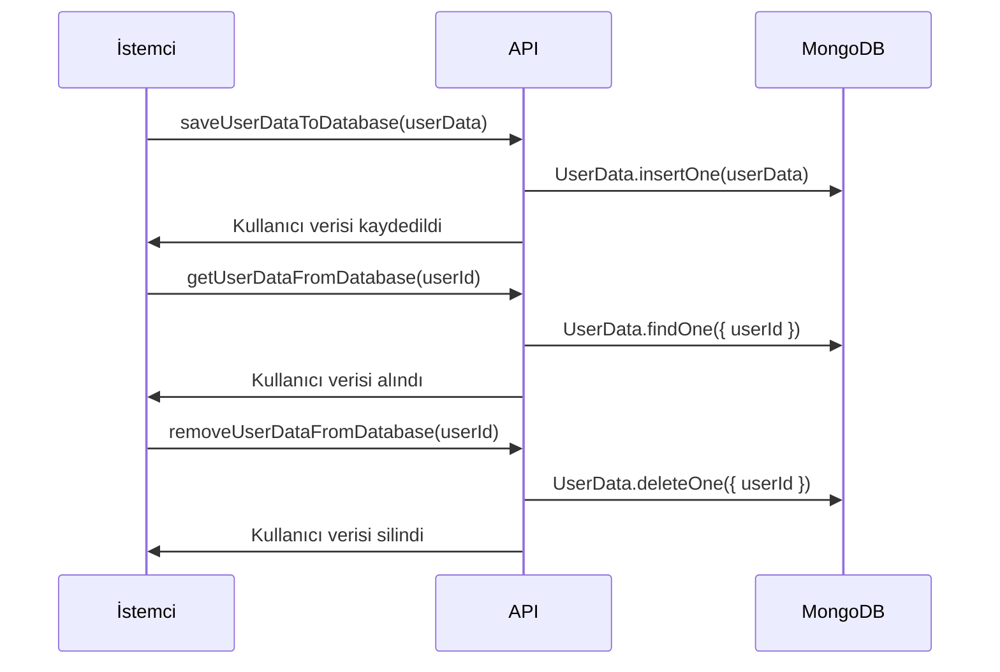

```mermaid
sequenceDiagram
    participant İstemci
    participant API
    participant MongoDB

    İstemci->>API: saveUserDataToDatabase(userData)
    API->>MongoDB: UserData.insertOne(userData)
    API->>İstemci: Kullanıcı verisi kaydedildi

    İstemci->>API: getUserDataFromDatabase(userId)
    API->>MongoDB: UserData.findOne({ userId })
    API->>İstemci: Kullanıcı verisi alındı

    İstemci->>API: removeUserDataFromDatabase(userId)
    API->>MongoDB: UserData.deleteOne({ userId })
    API->>İstemci: Kullanıcı verisi silindi
```
